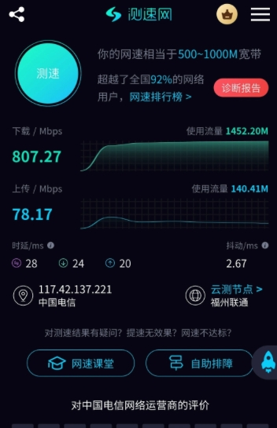
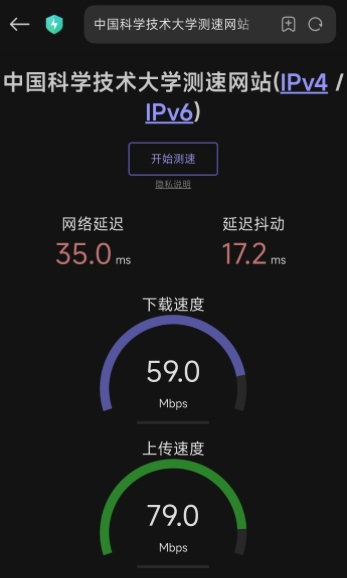
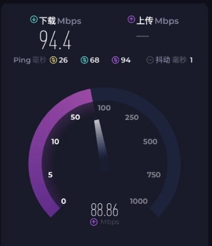

# 浪滔天工作室 | 回国VPN | 回国网络 | RouterOS / OpenWrt / iKuai / 星链回国

浪滔天工作室专注于**回国VPN**、**回国网络**、**回国线路优化** 和 **低延迟大带宽网络体验**，承接 `RouterOS`、`OpenWrt`、`iKuai`、Linux 软路由配置，以及**星链回国**、线路维护、网络优化和长期运维支持。

最近更新：2026年4月28日  
联系方式：Telegram [@Langtaotian_bot](https://t.me/Langtaotian_bot)

## 回国VPN / 回国网络服务介绍

如果你人在海外，想通过**回国VPN**更稳定地访问中国大陆网络环境，或者你正在找 `iKuai` 回国、`RouterOS` 回国、`OpenWrt` 回国、星链回国这类方案，但现有线路出现延迟高、带宽跑不满、丢包波动大、规则混乱等问题，浪滔天工作室可以提供更偏实战落地的回国VPN与回国网络优化服务。

这个 GitHub 页面主要介绍我们的回国网络服务范围、适合人群、核心优势、支持设备和常见问题，方便用户快速了解是否适合自己的使用场景。

## 我们服务谁

- 需要访问国内网站、国内 App、国内视频和国内办公系统的用户
- 需要低延迟、大带宽回国网络体验的用户
- 需要 `iKuai` 回国网络配置和优化的用户
- 需要 `RouterOS`、`OpenWrt` 或 Linux 软路由配置的用户
- 需要园区回国网络环境整理和优化的用户
- 需要星链回国网络方案的用户
- 已经有线路，但延迟高、带宽跑不满、体验不稳定的用户
- 想找长期维护而不是一次性装机的用户

## 主营服务

- 回国VPN 搭建与优化
- 回国网络搭建与优化
- 回国线路整理和长期维护
- 低延迟回国网络优化
- 大带宽回国网络优化
- `RouterOS` 软路由配置
- `OpenWrt`、`iKuai`、Linux 软路由部署与整理
- 星链回国网络接入与优化
- 分流、策略路由、DNS、NAT、转发规则整理
- 延迟、丢包、带宽、波动问题排查

## 为什么选择浪滔天工作室

- 主打回国VPN和回国网络，不是泛泛做所有网络杂项
- 更关注低延迟、大带宽、稳定性和长期可用性
- 同时支持 `RouterOS`、`OpenWrt`、`iKuai` 和 Linux 软路由
- 支持星链回国场景和海外回国网络场景
- 小白用户也能沟通，已有环境的优化维护也能接
- 不只是搭建，还能持续维护、巡检和调整

## 支持哪些设备和方案

- `RouterOS`
- `OpenWrt`
- `iKuai`
- Linux 软路由
- 星链回国网络环境
- 家用网络和工作室网络

## 常见使用场景

- 海外访问国内网站和国内 App
- 海外看国内视频、直播、音乐和日常内容
- 海外办公需要更稳定的中国大陆网络环境
- 回国线路延迟高，影响体验
- 带宽跑不满，高峰时段明显变慢
- 软路由已经装好，但规则越来越乱
- 想做 `RouterOS` 回国网络优化
- 想做星链回国网络接入

## 客户实测回国带宽示例

以下为部分客户的回国网络测速截图示例，方便直观看带宽和延迟表现。实际体验会受到所在地区、当地运营商、设备性能、测速时间段和线路配置影响。

<table>
  <tr>
    <td align="center">
      
       
      示例 1：高带宽回国测速截图
    </td>
    <td align="center">
      
       
      示例 2：低延迟回国测速截图
    </td>
    <td align="center">
      
       
      示例 3：回国带宽稳定性测速截图
    </td>
  </tr>
</table>

## 常见问题 FAQ

### 1. 回国网络延迟高怎么办

如果回国网络延迟高，常见原因包括线路质量不稳定、策略路由不合理、DNS 配置不佳、带宽拥塞或软路由规则混乱。我们可以按你当前的网络环境做排查和优化，目标是把回国网络体验尽量往低延迟、稳定方向调整。

### 2. 回国网络带宽跑不满怎么办

带宽跑不满不一定是单纯的带宽问题，也可能和线路质量、路由策略、设备性能、配置方式有关。我们会结合你的软路由环境、线路状况和实际使用需求，做更适合大带宽场景的整理和优化。

### 3. `RouterOS` 可以做回国网络吗

可以。`RouterOS` 适合做软路由、策略路由、分流、DNS 和基础网络规则整理。如果你已经在用 `RouterOS`，或者准备上 `RouterOS` 做回国网络，我们可以帮你搭建、整理和长期维护。

### 4. `iKuai`、`OpenWrt` 和 `RouterOS` 该怎么选

如果你还不确定该选 `iKuai`、`OpenWrt` 还是 `RouterOS`，可以直接按你的设备、预算和使用需求来沟通。不同用户适合的方案不一样，重点不是“哪个名字更强”，而是哪个更适合你的回国网络场景。

### 5. 星链回国可以做吗

可以。我们支持星链回国相关的网络接入与整理，适合需要在特殊网络环境下稳定访问中国大陆网络的用户。实际方案会根据你的设备、网络位置和目标使用场景来定。

### 6. 小白用户能不能找

可以。如果你只知道自己人在海外，想顺畅使用国内网络，但不清楚该选什么设备、怎么配置、怎么维护，也可以直接联系。我们会按你的实际情况给出更容易落地的建议。

## 我们能提供什么

- 从零搭建一套可用的回国网络环境
- 按低延迟、大带宽目标做线路整理与优化
- 配置 `RouterOS`、`OpenWrt`、`iKuai`、Linux 软路由
- 整理分流、DNS、策略路由、NAT 和基础网络规则
- 排查延迟、丢包、带宽、波动和线路质量问题
- 做长期维护、巡检和后续调整

## 详细说明

- [服务范围](docs/services.md)
- [交付流程](docs/delivery.md)

## 联系方式

- Telegram: [@Langtaotian_bot](https://t.me/Langtaotian_bot)
- 联系按钮页: [Langtaotian_bot_button.html](Langtaotian_bot_button.html)

## 关键词

回国VPN、回国网络、回国线路、低延迟回国网络、大带宽回国网络、`iKuai` 回国、`RouterOS` 回国、`OpenWrt` 回国、星链回国、园区回国网络、软路由配置、海外访问国内网络、海外回国网络优化
